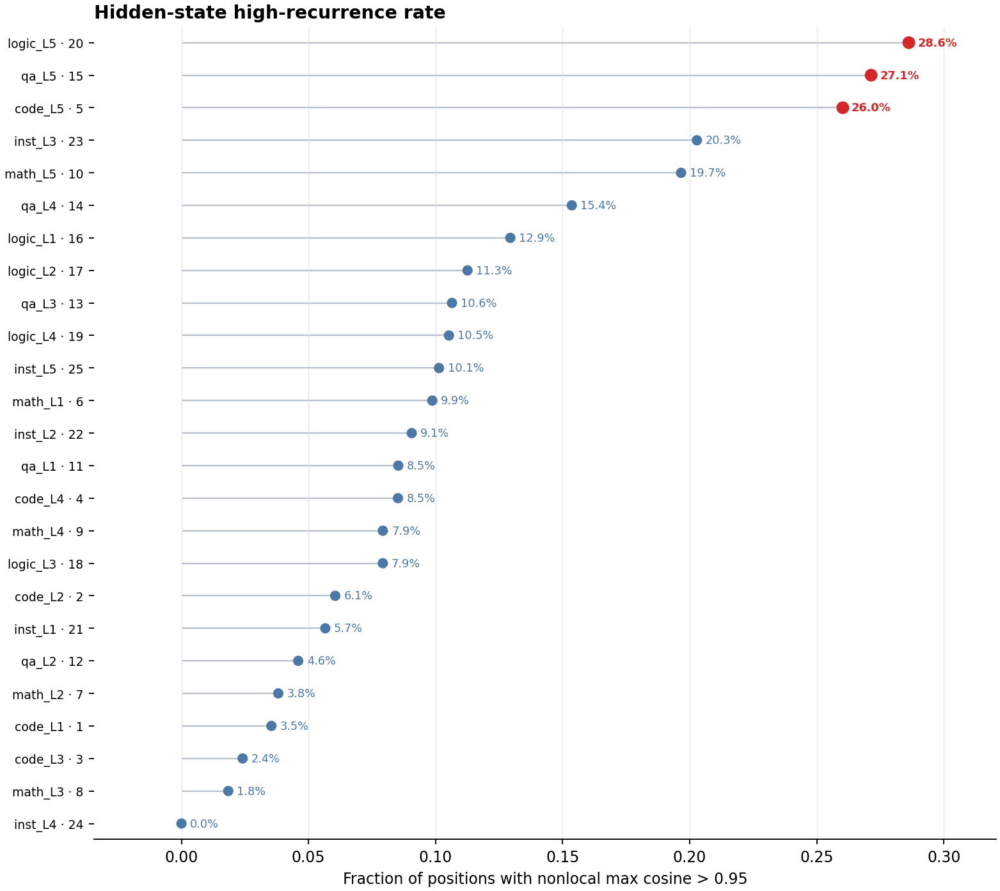
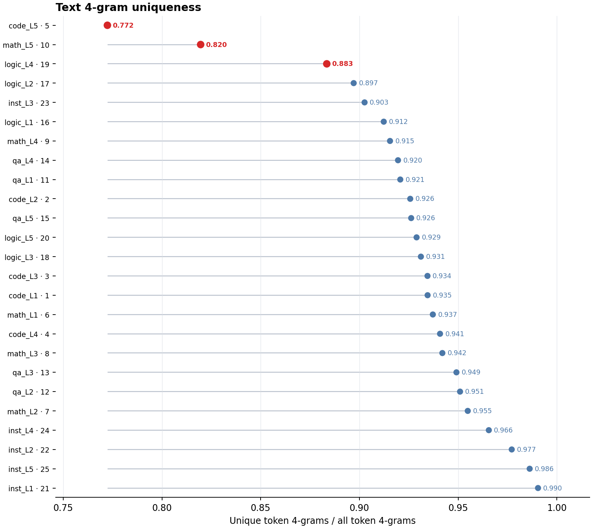
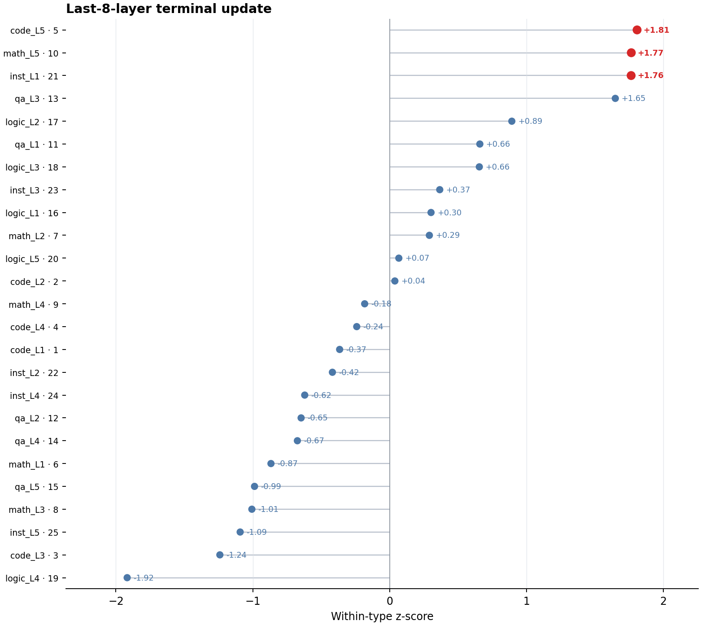
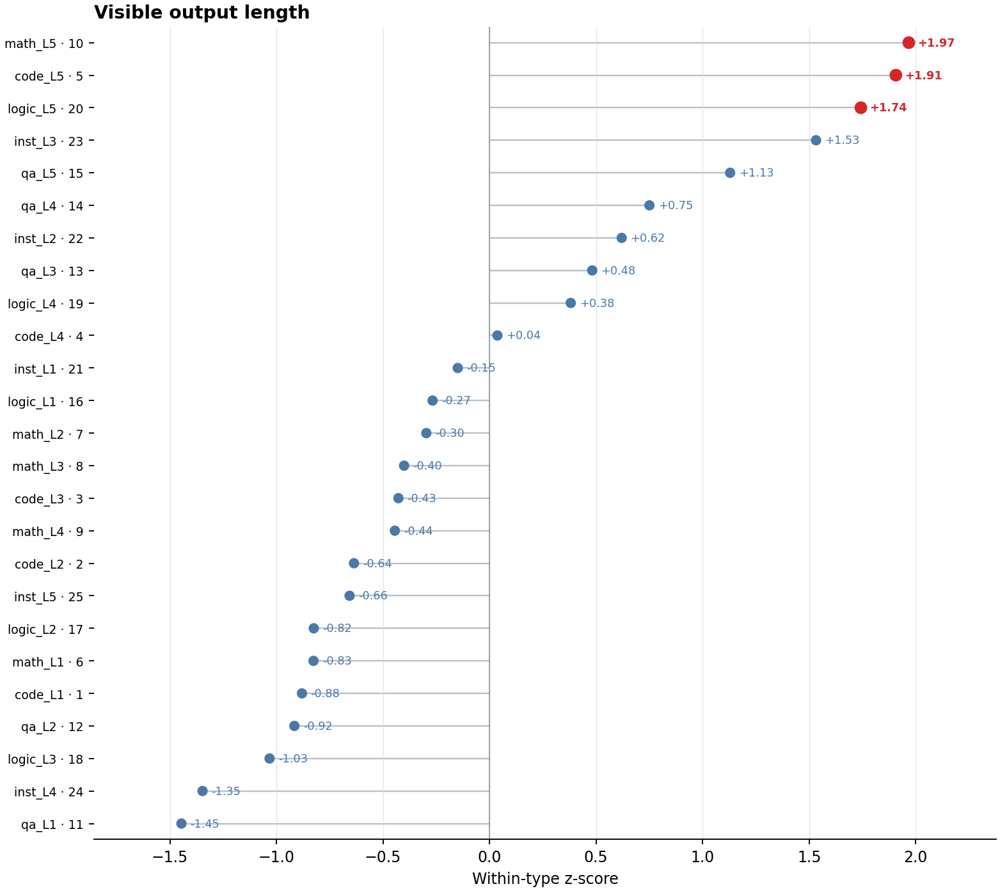
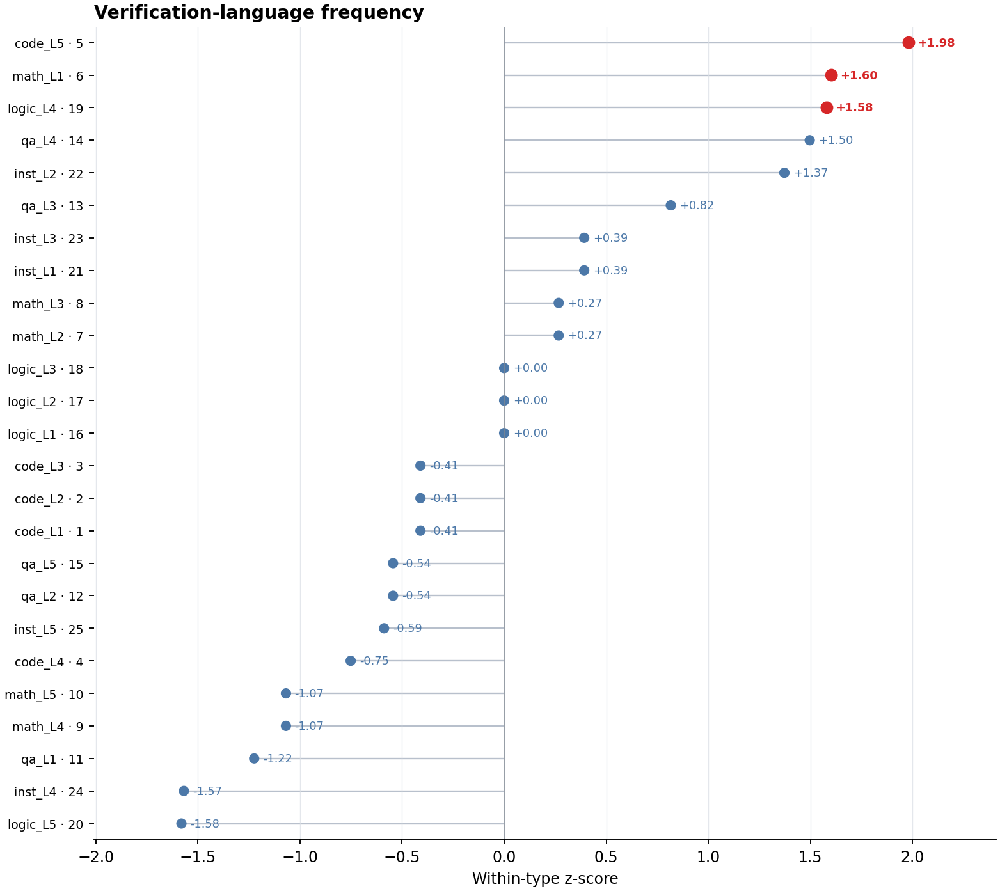

# 六维输出：分布差异最明显的指标

## 范围与标记方式

本报告只使用 `six_dimension` 分支，并只保留目前分布差异最容易观察和解释的 5 个指标。每幅图标注全部 25 道题；红色为该指标方向上最极端的 3 道题，用于视觉关注，不表示统计显著、题目必然困难或回答必然错误。

## 1. 隐藏状态高复现位置比例

**计算方法**

设最终层第 `t` 个生成 token 的隐藏状态为 $h_t$。先进行 L2 归一化，再只与至少相隔 32 token 的位置比较：

$$
m_t=\max_{s:\lvert s-t\rvert\ge 32}\cos(h_t,h_s)
$$

高复现率为：

$$
R_{rec}=\frac{1}{|T|}\sum_{t\in T}\mathbf{1}(m_t>0.95)
$$

其中 $T$ 只包含存在有效远距离比较对象的位置。数值越高，表示越多位置重新接近远处已经出现过的隐藏状态。32-token 间隔用于排除相邻文本的自然连续性，0.95 是本实验固定的高相似阈值。

对每个 token，寻找与它至少相隔 32 token 的隐藏状态中最大余弦相似度；最大值超过 0.95 的 token 比例即为该指标。Logic L5（28.6%）、QA L5（27.1%）和 Code L5（26.0%）最突出。Logic L3 为 7.9%，没有显示六维输出已经进入隐藏状态循环。

该指标是当前最直接的隐藏层重复信号，但固定六维标题和模板也可能提高复现率，因此需要与文字重复指标联合判断。

## 2. 文本 4-gram 唯一率

**计算方法**

使用生成 token ID 序列 $x_1,\ldots,x_N$，构造所有连续四元组：

$$
G=\{(x_t,x_{t+1},x_{t+2},x_{t+3})\mid1\le t\le N-3\}
$$

唯一率为：

$$
U_4=\frac{|\operatorname{unique}(G)|}{\max(1,N-3)}
$$

接近 1 表示四元组很少重复，越低表示相同 token 片段重复越多。这里按模型 token 计算，而不是按汉字或空格分词。

唯一率越低，实际 token 片段重复越多。Code L5（0.772）和 Math L5（0.820）与其余题的距离最明显；Logic L3 为 0.931，文字层面没有明显绕圈。

它与隐藏高复现率形成互补：两者同时异常才是更强的循环证据。Code L5 同时满足“隐藏复现高”和“文字唯一率低”，是当前最明确的重复样本。

## 3. 后 8 层末段变化

**计算方法**

取回答最后最多 32 个生成位置组成 $P_{tail}$，对最深处连续 8 个层间转换计算同一 token 在相邻层的余弦距离：

$$
D_{late8,tail}=\frac{1}{8|P_{tail}|}
\sum_{l=L-7}^{L}\sum_{t\in P_{tail}}
\left(1-\cos(h_t^{(l)},h_t^{(l-1)})\right)
$$

再在同题型 5 道题内计算总体 z-score：

$$
z_i=\frac{D_i-\mu_{type(i)}}{\sigma_{type(i)}}
$$

图中展示这个 z-score。正值表示末段深层更新强于同题型平均，负值表示弱于平均；它描述表示变化幅度，不等于推理深度。

该指标比较回答最后最多 32 个 token 在最深 8 个层间转换中的平均余弦距离，并在同题型内转为 z-score。Code L5（+1.808）和 Math L5（+1.766）明显偏高，说明回答收尾位置在深层仍发生较强的表示更新。Instruction L1（+1.765）同样偏高，说明该指标并不随题目级别单调增长。

Logic L3 为 +0.655，只是温和高于同类中心。因此这个指标适合发现“末段深层动态异常”，但不能单独当作难度分数。

## 4. 可见输出长度

**计算方法**

若生成以 EOS 结束，从生成 token 总数中减去 EOS，得到可见 token 数 $N_i$，随后在同题型内标准化：

$$
z_{length,i}=\frac{N_i-\mu_{type(i)}}{\sigma_{type(i)}}
$$

图中展示标准化值而非原始 token 数。正值表示比同类题更长，负值表示更短；它衡量表达篇幅，不等于有效推理量。

输出 token 数在同题型内标准化后，Math L5（+1.968）、Code L5（+1.907）和 Logic L5（+1.743）最突出。它是当前最清楚的“模型认为需要投入更多表达和规划”的信号。

Logic L3 为 −1.032，反而比其他逻辑题短。这支持一个重要判断：模型在六维阶段没有真正展开 Logic L3 的约束求解，因此也没有提前暴露后来完整回答中的循环问题。

## 5. 验证相关表述次数

**计算方法**

将输出转为小写，对固定词典逐项进行不重叠子串计数并求和。词典为：`check`、`verify`、`validate`、`test`、`review`、`confirm`、`检查`、`验证`、`测试`、`复核`、`确认`。设计数为 $C_i$：

$$
z_{verify,i}=\frac{C_i-\mu_{type(i)}}{\sigma_{type(i)}}
$$

若同题型 5 题的计数完全相同、标准差为 0，则 z-score 统一记为 0。该方法不理解否定、同义改写或语境，只衡量显式验证措辞。

Code L5 的验证表述最突出（z=+1.982），与它较长的输出和较强深层末段变化一致。不过另外两个高值是 Math L1（+1.604）和 Logic L4（+1.581），并不集中在高难度题。

因此验证表述适合作为“模型显式提到检查或验证”的辅助指标，但它比输出长度、文字重复和隐藏复现更容易受措辞习惯影响，不适合单独判断难度。

## 共同计算说明

以上五项均排除仅作为终止标记的 EOS，并只使用 `six_dimension` 分支的可见生成 token。

所有 z-score 都只在 Code、Math、QA、Logic、Instruction 各自的 5 道题内部计算，标准差使用 `ddof=0`：

$$
z_{i,j}=\frac{x_{i,j}-\mu_{type(i),j}}{\sigma_{type(i),j}}
$$

因此图中偏离表示“不同于同题型中心”，不能解释为跨题型的绝对难度或错误概率。

## 结论

最值得保留的判断顺序是：

1. 判断是否已经重复：联合查看“隐藏状态高复现率”和“4-gram 唯一率”。
2. 判断六维阶段是否感知到复杂度：优先看同题型标准化后的输出长度。
3. 判断回答收尾是否存在深层动态异常：看后 8 层末段变化。
4. 验证表述次数只作为辅助证据。

对重点题的结论没有改变：Code L5 在重复、长度和末段深层变化上都有一致信号；Logic L3 在这五项中均没有形成明显异常，说明六维短输出没有进入后来完整求解时的循环轨迹。
